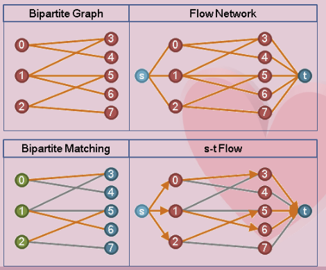

# Introduction

由於研究中需要用到這塊知識，開始學習圖論相關的知識。

Maching problems:

- Stable Marriage Problem(SMP)
- ...

# Matching

> 給定一張無向圖，當圖上兩點以邊相連時，這兩點就可以配成一對 ── 但是呢，一個點最多只能與一個鄰點配成一對，寧可孤家寡人，萬萬不可三妻四妾。雙雙對對之間的邊，整體成為一個「匹配」。

## Matching Problem
### Introduction
{#fig:id}

### Mached and Unmatched vertex/edge

{#fig:id}

### Cardinality

> 一個匹配擁有的匹配邊數目，也就是配對的數目，稱作 Cardinality ，尚無適當中譯。

> 一個匹配擁有的匹配邊數目，也就是配對的數目，稱作 Cardinality ，尚無適當中譯。

{#fig:id}

> 順便介紹一些特別的匹配：

- maximal matching：一張圖中，沒有辦法直接增加配對數的匹配。 (最大)
- maximum matching：一張圖中，配對數最多的匹配。也是maximal matching。 (最大值)
- perfect matching：一張圖中，所有點都送作堆的匹配。也是maximum matching。

### Weight

> 當圖上的邊都有權重，一個匹配的權重是所有匹配邊的權重總和。

{#fig:id}

- maximum weight matching：
 一張圖中，權重最大的匹配。
- maximum weight maximum cardinality matching：
一張圖中，配對數最多的前提下，權重最大的匹配。
- maximum weight perfect matching：
一張圖中，所有點都送作堆的前提下，權重最大的匹配。

## Bipartite Matching

### Introduction

>「二分匹配」。一張二分圖上的匹配稱作二分匹配，理所當然所有的匹配邊都是這橫跨這兩群點的邊，就像是連連看一樣。

{#fig:id}

### Solve Bipartite Matching using Flow

> 一側接上源點，一側接上匯點，即可利用網路流來解決最大二分匹配問題、最大（小）權二分匹配問題。

# Algorithms
## Augmenting Path Theorem （ Berge's Theorem ）

## Maximum Cardinality Bipartite Matching
Augmenting Path Algorithm

## Maximum Cardinality Matching
Blossom Algorithm

## Maximum Cardinality Bipartite Matching
Hopcroft-Karp Algorithm

## Maximum Cardinality Matching
Micali-Vazirani Algorithm

## Maximum Weight Perfect Bipartite Matching
Hungarian Algorithm （ Kuhn-Munkres Algorithm ）

# Reference
- [csie.ntnu.edu.tw-Bipartite](http://www.csie.ntnu.edu.tw/~u91029/BipartiteGraph.html)
- [wiki-Bipartite-graph](https://en.wikipedia.org/wiki/Bipartite_graph)

# Acknowledgments

Thanks for the contribution of  [csie.ntnu.edu.tw-Bipartite](http://www.csie.ntnu.edu.tw/~u91029/BipartiteGraph.html)

**Note:**

本文中引用了很多網絡上的資源，在參考文獻中已列出，在此僅作學習用，如有侵權，請及時聯系以刪除。
